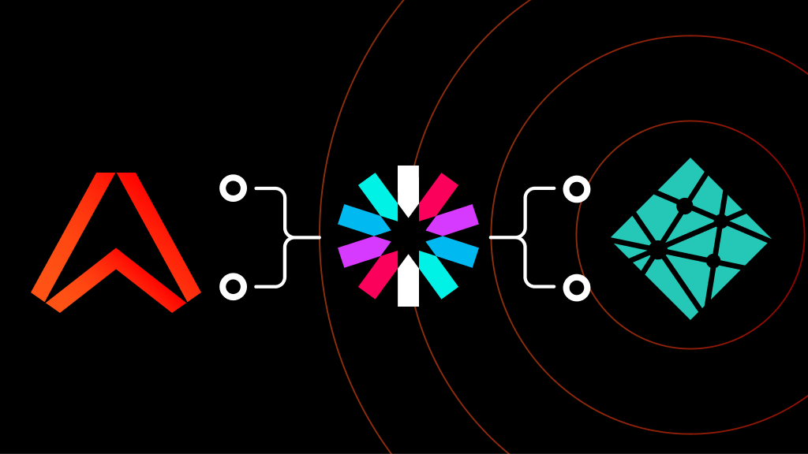
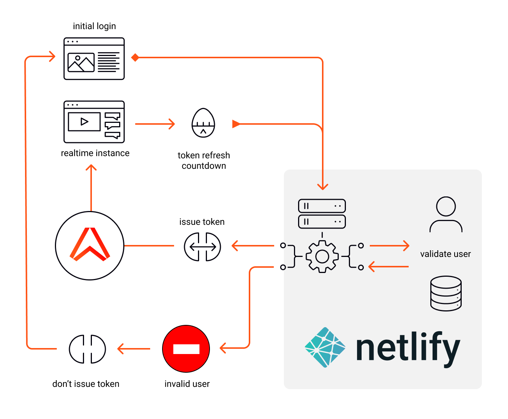
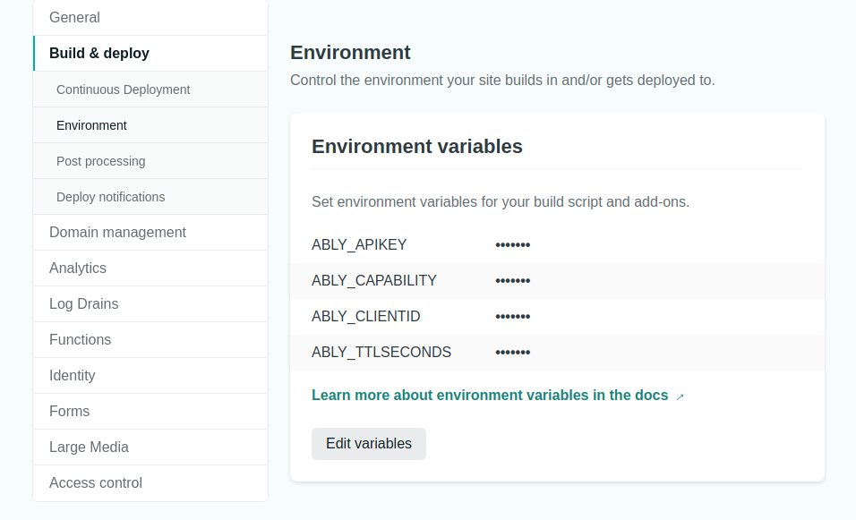
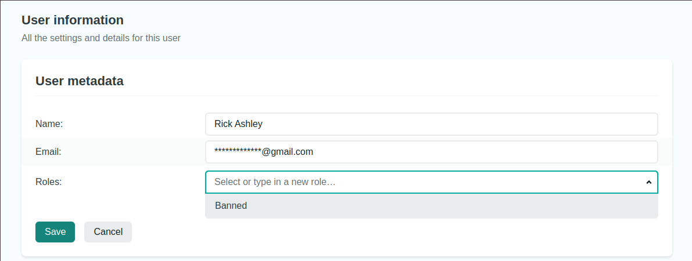

// This is a template repository to be used for all Ably Labs demos, tools &amp; proof of concepts. Follow these steps to so this repo is easy to use for visitors & maintainers.

- [ ] Update the description of this repo.
- [ ] Add [topics](https://docs.github.com/en/repositories/managing-your-repositorys-settings-and-features/customizing-your-repository/classifying-your-repository-with-topics) to this repo to clarify the language, tech stack and use case.
- [x] Update the [.gitignore](.gitignore) file with one of the [standard templates from GitHub](https://github.com/github/gitignore).
- [ ] Update [dependabot.yml](.github/dependabot.yml) with the [configuration for your project](https://docs.github.com/en/code-security/supply-chain-security/keeping-your-dependencies-updated-automatically/configuration-options-for-dependency-updates).
- [ ] Replace `https://github.com/ably-labs/ably-labs-template-repo/issues` with the actual link of the repo in the [CONTRIBUTING.md](CONTRIBUTING.md) file.
- [ ] Update this README so it provides enough information for people to understand how it works, how to run it locally and how it can be deployed to the cloud (see [GitHub](https://docs.github.com/en/repositories/managing-your-repositorys-settings-and-features/customizing-your-repository/about-readmes)).
- [ ] Add a GitHub workflow to build/test/deploy your application. Use the [Ably Control API GitHub action](https://github.com/ably-labs/ably-control-api-action) to avoid creating Ably apps/API keys manually.
- [ ] Add this repository to the [selected repositories in the Ably Labs org](https://github.com/organizations/ably-labs/settings/actions) that are allowed to run GitHub Actions.

Once you're done, remove this section from the README. Good luck! 💪

# Netlify Identity & JWT authentication

## Description

// Explanation of the contents of the repository. Describe the use case.

## What you'll need

1. An Ably API Key, sign up for a [free account](https://ably.com/sign-up)
1. A [Netlify](https://netlify.com) account to host and manage your registered users.
1. A [Github](https://github.com) account is required to link Netlify to the repository.

# Overview of architecture

This is the overview of our app. Our user experience requires a new user to register and confirm their email address to activate themselves with our app before they can log-in. When they login we validate them with Netlify Identity and check that they have not been flagged as Banned. Bad actors are not issued with a JWT token. Valid users are issued a token, to authenticate with Ably, and the authentication URL carries the user's unique ID.

The Netlify Identity allows us to administer users by editing metadata associated with their account, flagging a bad actor is a matter of assigning them a role via the Netlify dashboard.

## Initial steps
1. Fork this repository
1. Use Netlify dashboard to create a new project, and select your fork as the source.
1. Add the environment variables to the new Netlify app from the site settings section, under `Build & deploy`
1. Deploy the website, visit the homepage and sign-up as a new user.
1. Log-in with the confirmed user and you'll be able to connect to Ably realtime

## Environment variables

## Register a new user to your app

At this point your setup is complete, and you can start adding users. Open the
website and use the sign-up link to add a user. This will trigger an email
confirmation and when that is complete your new user will be able to login
and connect to the Ably realtime network.

## Banning a User from connecting

Lets us pretend that one of your registered users needs to be banned. We can do
this by modifiying their account metadata, and assigning a role of `Banned`

1. Log-in to the Netlify dashboard for your app.
1. Go to the `Identity` section, and select a User account.
1. Edit the User metadata, and add the string `Banned` to the role and save.
1. Then return to the website, login as that user and click connect.

This will cause the next authentication attempt by that user to fail,
the JWT will not be issued to that User and display an error message.

Conversely you can revese the bann by clearing the assigned role.

## Running localhost

The majority of the Netlify functionality can be reproduced locally by using the Netlify CLI tool.
However the Identity features will not behave as expected when using local development server.
This is a known constraint and Identity functionality requires the production server.

## Building & running locally

### Prerequisites

1. [Sign up](https://ably.com/signup) or [log in](https://ably.com/login) to ably.com, and [create a new app and copy the API key](https://faqs.ably.com/setting-up-and-managing-api-keys).
2. Install X
3. Install Y

### Building the project

// Add step by step instructions for building & running locally.

## Deploying to the cloud

// Add step by step instructions for deployment. Refer to the GitHub workflow where possible.

## Contributing

We have a [contributing guide](CONTRIBUTING.md) that explains how to contribute to this repository.

## More info

// Add links to related blog, video, personal twitter handle.

- [Ably on Twitter](https://twitter.com/ablyrealtime)
- [Ably SDKs](https://github.com/ably/)
- [Ably.com](https://ably.com)

---

